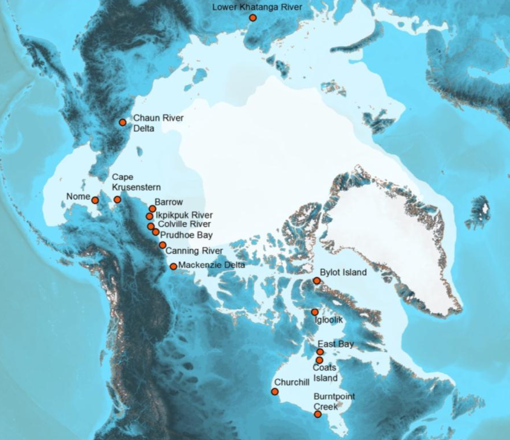

# Cleaning the shorebird survey data

## The data set

ARCTIC SHOREBIRD DEMOGRAPHICS NETWORK (ASDN)
<a href="https://doi.org/10.18739/A2222R68W"
target="_blank">https://doi.org/10.18739/A2222R68W</a>

Data set hosted by the
<a href="https://arcticdata.io" target="_blank">NSF Arctic Data
Center</a> data repository

### Introduction

Recent shorebird trend analyses indicate that many North America
shorebirds are declining, but we do not know why (Morrison et al. 2006).
**The goal of the Arctic Shorebird Demographic Network is to
collaboratively conuct demographic studies on several shorebird focal
species that will help determine factors limiting their population
size**. The Network will measure demographic rates such as adult
apparent survival, annual productivity, population age-structure, etc.
on the Arctic breeding grounds. Additionally, site-specific ecological
and environmental variables (e.g. food resources, prey and predator
abundance, weather, etc.) that influence demographic rates and are
influenced by climate change and other anthropogenic forces will be
measured and incorporated into the analyses.

### Study sites

Field data on shorebird ecology and environmental conditions were
collected from 1993-2014 at 16 field sites in Alaska, Canada, and
Russia.

 

Data were **not** collected every year at all sites. Studies of the
population ecology of these birds included nest-monitoring to determine
the timing of reproduction and reproductive success; live capture of
birds to collect blood samples, feathers, and fecal samples for
investigations of population structure and pathogens; banding of birds
to determine annual survival rates; resighting of color-banded birds to
determine space use and site fidelity; and use of light-sensitive
geolocators to investigate migratory movements.

Data on climatic conditions, prey abundance, and predators were also
collected. Environmental data included weather stations that recorded
daily climatic conditions, surveys of seasonal snowmelt, weekly sampling
of terrestrial and aquatic invertebrates that are prey of shorebirds,
live trapping of small mammals (alternate prey for shorebird predators),
and daily counts of potential predators (jaegers, falcons, foxes).
Detailed field methods for each year are available in the
`ASDN_protocol_201X.pdf` files. All research was conducted under permits
from relevant federal, state, and university authorities.

*See `01_ASDN_Readme.txt` provided in the [course data
repository](https://github.com/UCSB-Library-Research-Data-Services/bren-meds213-spring-2024-class-data)
for full metadata information about this data set.*
